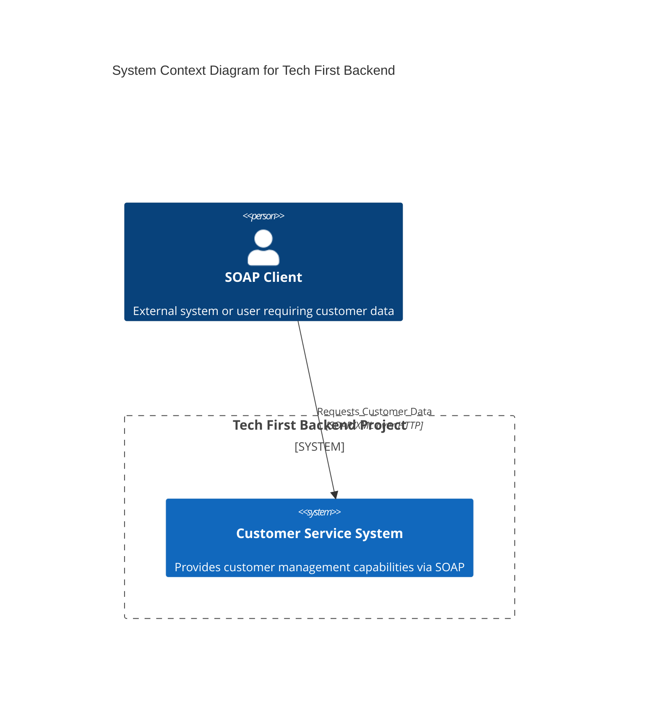
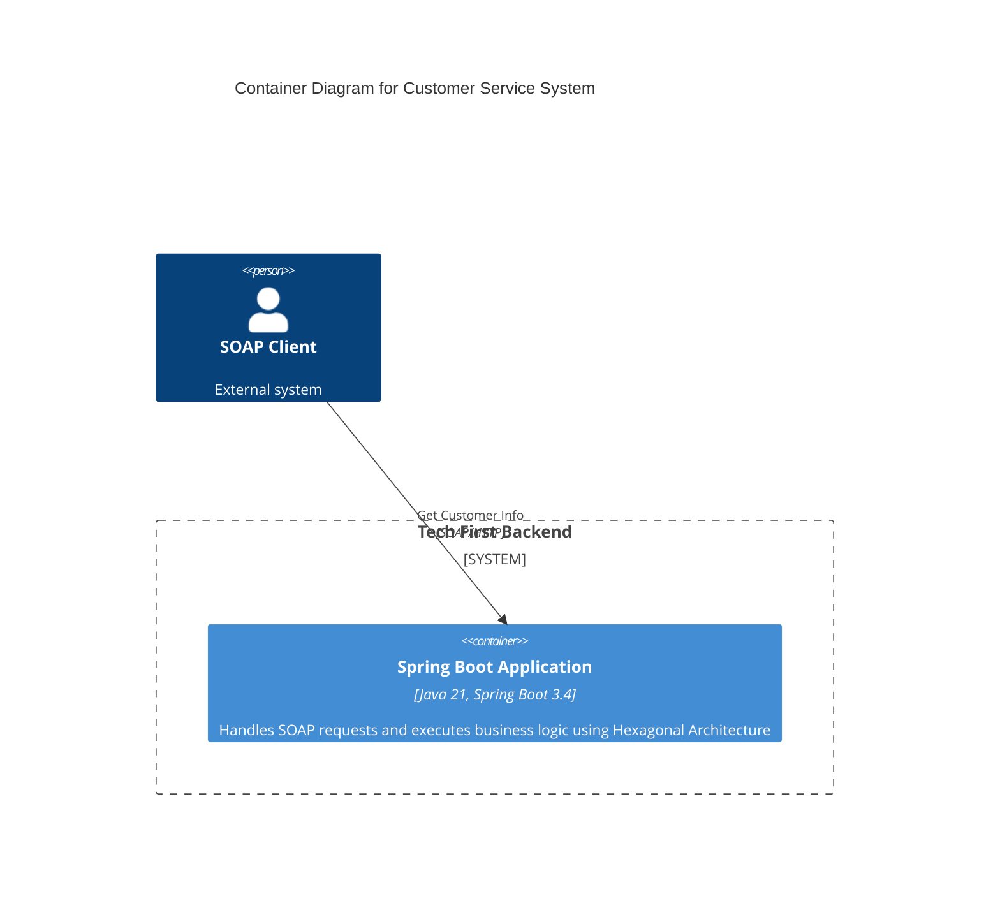

# Tech First Backend - Architecture Diagrams

이 문서는 `tech-first-backend` 프로젝트(Part 1. Hexagonal Architecture)의 구조를 시각화한 C4 모델 다이어그램을 포함합니다.

## 1. System Context Diagram (Level 1)
시스템의 전체적인 컨텍스트와 외부 사용자와의 관계를 보여줍니다.

## 2. Container Diagram (Level 2)
시스템 내부의 실행 가능한 애플리케이션(컨테이너) 구조를 보여줍니다.

## 3. Component Diagram (Level 3) - Hexagonal Architecture
애플리케이션 내부의 컴포넌트(어댑터, 포트, 서비스, 도메인) 간의 관계를 상세히 보여줍니다.

```mermaid
classDiagram
    direction LR

    %% Define Namespaces/Packages based on Hexagonal Architecture
    namespace Adapter_In_Web {
        class CustomerSoapEndpoint {
            <<Driving Adapter>>
            +getCustomer(GetCustomerRequest) GetCustomerResponse
        }
    }

    namespace Application_Port_In {
        class CustomerUseCase {
            <<Input Port>>
            +getCustomer(Long id) Customer
        }
    }

    namespace Application_Service {
        class CustomerService {
            <<Application Service>>
            +getCustomer(Long id) Customer
        }
    }

    namespace Domain_Model {
        class Customer {
            <<Domain Entity>>
            -Long id
            -String name
            -String email
        }
    }

    %% Relationships
    CustomerSoapEndpoint ..> CustomerUseCase : Calls
    CustomerService ..|> CustomerUseCase : Implements
    CustomerService ..> Customer : Returns
    
    %% Layout Hints
    note for CustomerSoapEndpoint "Adapter receives SOAP request\nand calls Input Port"
    note for CustomerUseCase "Defines the interface\nfor business operations"
    note for CustomerService "Implements business logic"
```

