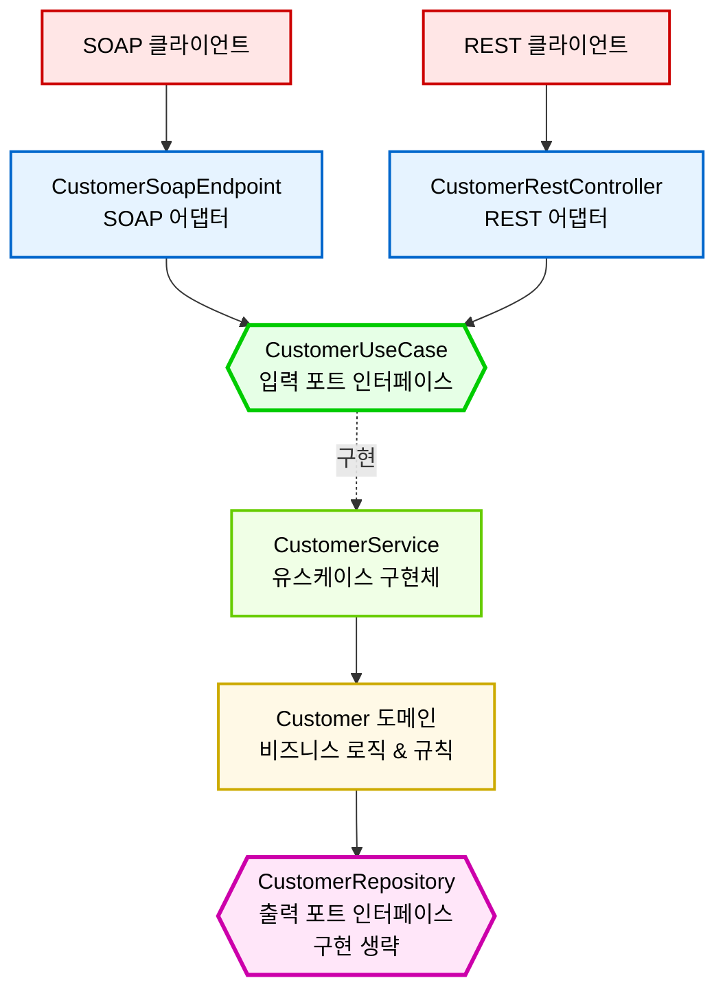

# [Hexagonal Architecture] Logical Request Flow Diagram

이 다이어그램은 `tech-first-backend` 프로젝트의 헥사고날 아키텍처에서 외부 클라이언트의 요청이 어떻게 애플리케이션 코어의 `CustomerUseCase`로 전달되고 처리되는지 논리적인 흐름을 시각화합니다.

물리적인 구현체보다는 **역할과 흐름**에 초점을 맞추어, 다양한 클라이언트가 어떻게 동일한 핵심 비즈니스 로직에 접근하는지 보여줍니다.

